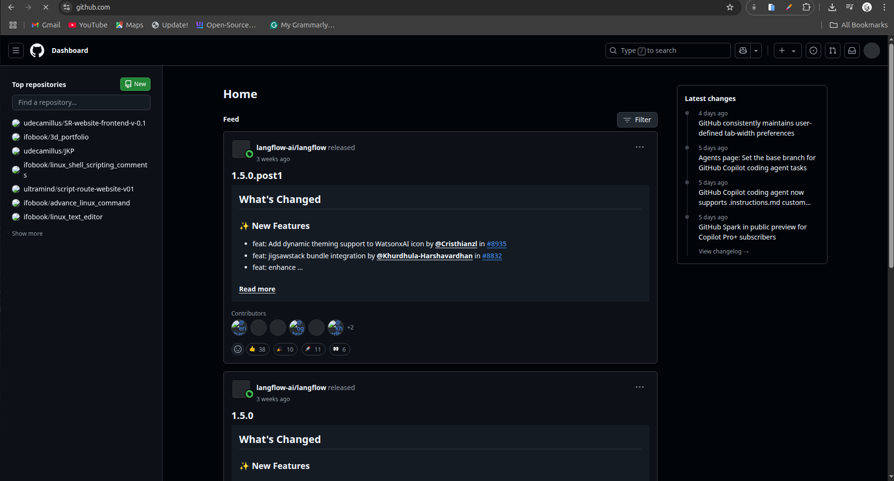
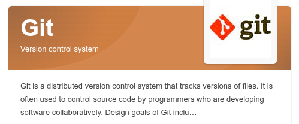
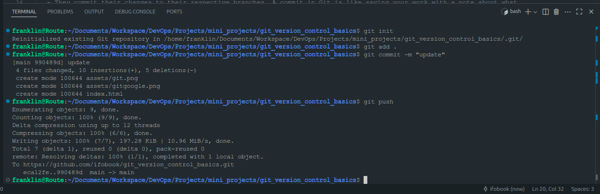
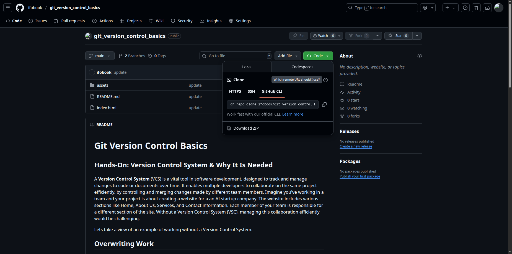
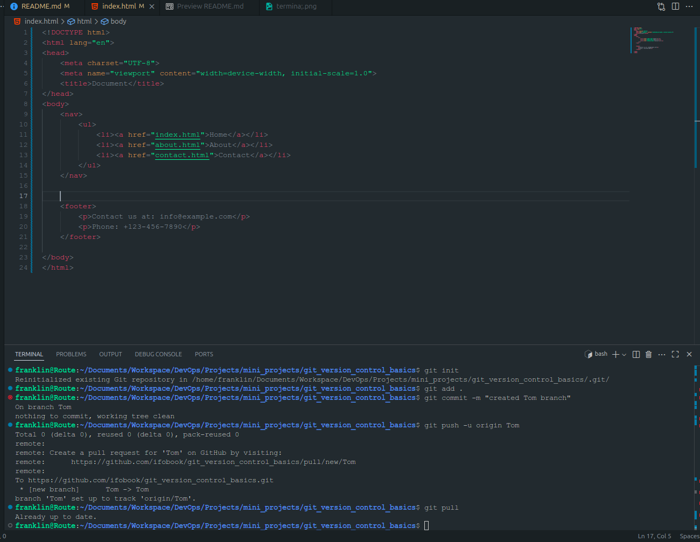
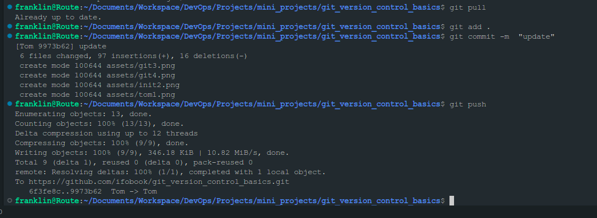
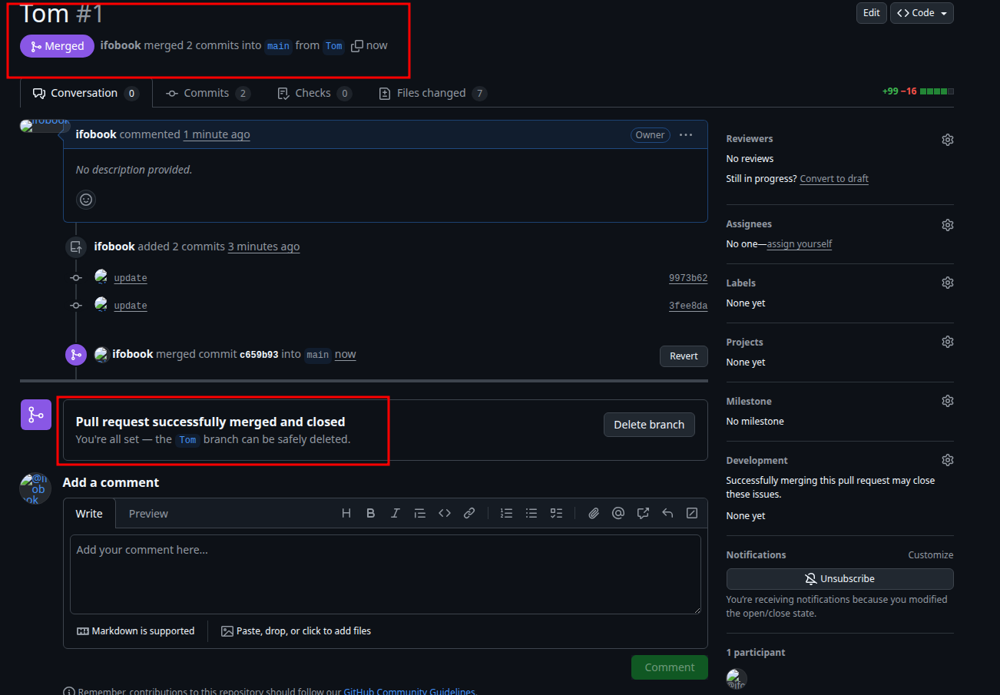

# Git Version Control Basics

## Hands-On: Version Control System & Why It Is Needed

A **Version Control System** (VCS) is a vital tool in software development, designed to track and manage changes to code or documents over time. It enables multiple developers to collaborate on the same project efficiently, by controlling and merging changes made by different team members.
Imagine you've working in a team and your project is about creating a website for a an AI startup company. The website includes various sections like Home, About Us, Services, and Contact information. Each member of your team is responsible for a different section of the site. Without a Version Control System (VSC), managing this collaboration efficiently would be challenging.


Lets take a view of an example of working without a Version Control System.

## Overwriting Work

If a member **"Tom"** makes changes to the home page file **"index.html"** to update the navigation and at the same time, another team member **"Jerry"** makes changes to add contact information to the footer of the same home page thereby editing the same **"index.html"** file. Without VCS, the last person to upload their version of the file to the shared folder or server would overwrite the other person's changes, resulting in lost work.

## How VCS Solves These Problems

**Concurrent Development**: With a VCS, each team member can work on their sections simultaneously without fear of overwriting each other's work. The VCS tracks all changes and manages different versions of the files, allowing changes to be merged together eventually.
Lets go through an example together to simulate this experience using a VCS tool, **Git**

## Introducing Git: A Leading Version Control System

Git is a tool that helps people work together on computer projects, like building a website. Think of it as a shared folder on your computer, but much smarter. It keeps tracks of all the changes everyone makes, so if something goes wrong, you can always go back to a version that worked. It also lets everyone work on their parts at the same time without getting in each other's way.
When working on a project, especially with a team, it's easy for things to get mixed up if you're not careful. For example, if two people try to change the same thing at the same time, it could cause problems. Git helps prevent these kinds of mix-ups



## Conceptualising Git Set Up with Tom and Jerry

1. Initial Setup:
   

   - Both Tom and Jerry have Git installed on their computers,
   - They clone (or download) the project repository from a central repository (like **Github, GitLab, or Bitbucket**) to their local machines. This gives them each a complete copy of the project, including all its files and version history.

1. Tom and Jerry Start Working:
   

   - Tom and Jerry pull the latest changes from the central repository to ensure they start with the most current version of the **index.html** file,

```bash
   # Step 1: Make sure you are on the main branch and up to date
   git checkout main
   git pull origin main
```

```bash
   # Step 2: Create feature branches
git checkout -b Tom   # for Tom
git checkout -b Jerry # for Jerry

# Step 3: Push to the remote and set upstream
git push -u origin Tom   # for Tom
git push -u origin Jerry # for Jerry

```

- They both create a new branch from the main project. A branch in Git allows developers to work on a copy of the codebase without affecting the main line of development. Tom names his branch **update-navigation**, and Jerry names his **add-contact-info**.

1. Making Changes:

- On his branch, Tom updates the navigation bar in **index.html**

```bash
    git checkout Tom
# Make changes to the navigation bar
git add index.html
git commit -m "Updated navigation bar in index.html"
git push origin Tom

```

- simultaneously, Jerry works on his branch to add contact information to the footer of the same file.

```bash
   git checkout Jerry
# Make changes to the footer
git add index.html
git commit -m "Added contact info to footer"
git push origin Jerry

```

- They commit their changes to their respective branches. A commit in Git is like saving your work with a note about what you've done.

2. Merging Changes:

- Once they're done, Tom and Jerry push their branches to the central repository,
- Tom decided to merge his changes first, He creates a **pull request (PR)** for his branch **update-navigation**. A PR is a way to tell the team that he's done and his code is already to be reviewed and merged into the main project.
- After reviewing Tom's changes, the team merges his PR into the main branch, updating the **index.html** file on the main project line.
- Jerry then updates his branch with the latest changes from the main project to include Tom's updates. This step is crucial to ensure that Jerry is working with and intergrating his changes into the most current version of the project.
- Jerry resolves any conflicts that arise from Tom's changes and his own. Git provides tools and commands to help identify and solve these conflicts.

```bash
git checkout Jerry
git fetch origin
git merge origin/main
```

changes committed and pushed successfully:

changes merged:



## Conclusion:

Through this process, Tom and Jerry were able to work on the same file simultaneous, without overwriting each other's work. Git tracked their changes, allowing them to merge their updates seamlessly into the main project. This example illustrates the power of using a VSC like Git for collaborative development, ensuring that all contributions are preserved and integrated efficiently and effectively.
In the next mini project we will get hands on to simulate the entire journey between both Tom and Jerry

